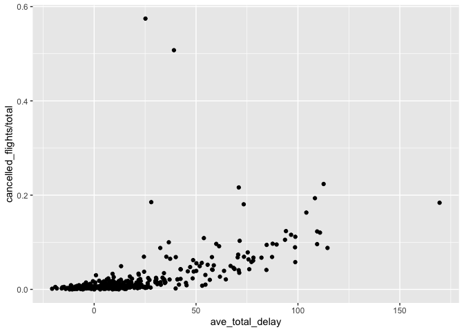

HW1
================
Jesse Ying
2022-09-28

## How many flights have a missing dep_time? What other variables are missing? What might these rows represent?

``` r
flights %>% 
  filter(is.na(dep_time)) %>% 
  count()
```

    ## # A tibble: 1 × 1
    ##       n
    ##   <int>
    ## 1  8255

``` r
summary(flights)
```

    ##       year          month             day           dep_time    sched_dep_time
    ##  Min.   :2013   Min.   : 1.000   Min.   : 1.00   Min.   :   1   Min.   : 106  
    ##  1st Qu.:2013   1st Qu.: 4.000   1st Qu.: 8.00   1st Qu.: 907   1st Qu.: 906  
    ##  Median :2013   Median : 7.000   Median :16.00   Median :1401   Median :1359  
    ##  Mean   :2013   Mean   : 6.549   Mean   :15.71   Mean   :1349   Mean   :1344  
    ##  3rd Qu.:2013   3rd Qu.:10.000   3rd Qu.:23.00   3rd Qu.:1744   3rd Qu.:1729  
    ##  Max.   :2013   Max.   :12.000   Max.   :31.00   Max.   :2400   Max.   :2359  
    ##                                                  NA's   :8255                 
    ##    dep_delay          arr_time    sched_arr_time   arr_delay       
    ##  Min.   : -43.00   Min.   :   1   Min.   :   1   Min.   : -86.000  
    ##  1st Qu.:  -5.00   1st Qu.:1104   1st Qu.:1124   1st Qu.: -17.000  
    ##  Median :  -2.00   Median :1535   Median :1556   Median :  -5.000  
    ##  Mean   :  12.64   Mean   :1502   Mean   :1536   Mean   :   6.895  
    ##  3rd Qu.:  11.00   3rd Qu.:1940   3rd Qu.:1945   3rd Qu.:  14.000  
    ##  Max.   :1301.00   Max.   :2400   Max.   :2359   Max.   :1272.000  
    ##  NA's   :8255      NA's   :8713                  NA's   :9430      
    ##    carrier              flight       tailnum             origin         
    ##  Length:336776      Min.   :   1   Length:336776      Length:336776     
    ##  Class :character   1st Qu.: 553   Class :character   Class :character  
    ##  Mode  :character   Median :1496   Mode  :character   Mode  :character  
    ##                     Mean   :1972                                        
    ##                     3rd Qu.:3465                                        
    ##                     Max.   :8500                                        
    ##                                                                         
    ##      dest              air_time        distance         hour      
    ##  Length:336776      Min.   : 20.0   Min.   :  17   Min.   : 1.00  
    ##  Class :character   1st Qu.: 82.0   1st Qu.: 502   1st Qu.: 9.00  
    ##  Mode  :character   Median :129.0   Median : 872   Median :13.00  
    ##                     Mean   :150.7   Mean   :1040   Mean   :13.18  
    ##                     3rd Qu.:192.0   3rd Qu.:1389   3rd Qu.:17.00  
    ##                     Max.   :695.0   Max.   :4983   Max.   :23.00  
    ##                     NA's   :9430                                  
    ##      minute        time_hour                  
    ##  Min.   : 0.00   Min.   :2013-01-01 05:00:00  
    ##  1st Qu.: 8.00   1st Qu.:2013-04-04 13:00:00  
    ##  Median :29.00   Median :2013-07-03 10:00:00  
    ##  Mean   :26.23   Mean   :2013-07-03 05:22:54  
    ##  3rd Qu.:44.00   3rd Qu.:2013-10-01 07:00:00  
    ##  Max.   :59.00   Max.   :2013-12-31 23:00:00  
    ## 

### 1)There are total 8255 flights have a missing dep_time.

### 2)dep_delay, arr_time, arr_delay, air_time have NAs.

### 3)These rows represent cancelled flights.

## Currently dep_time and sched_dep_time are convenient to look at, but hard to compute with because they’re not really continuous numbers. Convert them to a more convenient representation of number of minutes since midnight.

``` r
flights %>% 
  mutate(dep_time_min = (dep_time %/% 100) * 60 + (dep_time %% 100),
       sched_dep_time_min = (sched_dep_time %/% 100) * 60 + (sched_dep_time %% 100)) %>% 
  select(dep_time, sched_dep_time, dep_time_min, sched_dep_time_min)
```

    ## # A tibble: 336,776 × 4
    ##    dep_time sched_dep_time dep_time_min sched_dep_time_min
    ##       <int>          <int>        <dbl>              <dbl>
    ##  1      517            515          317                315
    ##  2      533            529          333                329
    ##  3      542            540          342                340
    ##  4      544            545          344                345
    ##  5      554            600          354                360
    ##  6      554            558          354                358
    ##  7      555            600          355                360
    ##  8      557            600          357                360
    ##  9      557            600          357                360
    ## 10      558            600          358                360
    ## # … with 336,766 more rows

## Look at the number of canceled flights per day. Is there a pattern? Is the proportion of canceled flights related to the average delay? Use multiple dyplr operations, all on one line, concluding with ggplot(aes(x= ,y=)) + geom_point()

``` r
flights %>%
  mutate(total_delay = dep_delay + arr_delay) %>% 
  group_by(year, month, day) %>% 
  summarize(cancelled_flights = sum(is.na(dep_delay)),
            total = n(),
            ave_total_delay = mean(total_delay, na.rm=T)
            ) %>% 
  ggplot(aes(y=cancelled_flights/total)) +
  geom_point(aes(x=ave_total_delay))
```

    ## `summarise()` has grouped output by 'year', 'month'. You can override using the `.groups` argument.

<!-- -->

### There is no clear pattern. But as the delay time increases, especially after 50min, the proportion of cancelled flights increases.
